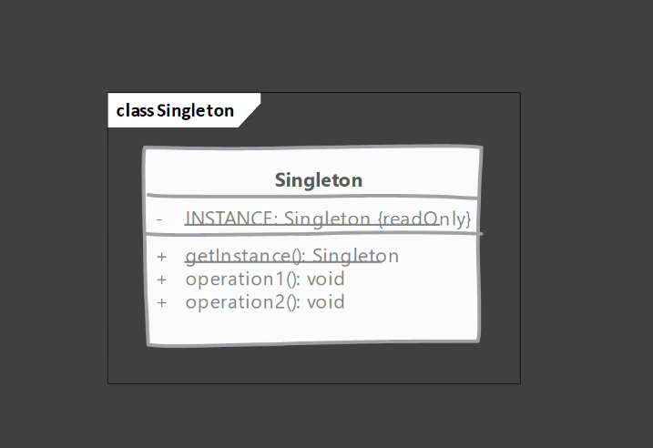

# Singleton-design-pattern

## This pattern is used to:

* Ensure a class has only one instance, and provide a global point of access to it.

* The singleton pattern is used in other design patterns like Abstract Factory, Builder, Prototype, Facade etc.

## The singleton pattern has a few variations, but all of them share the following common concepts:

* A private constructor / operator.

* A private static attribute that stores the unique instance of the class.

* A public static member function that returns a reference to the single instance.

## The pattern is used :
* When the sole instance should be extensible by subclassing, and clients should be able to use an extended instance without modifying their code.

* When the class is in a package of its own or is a standalone class.

* When you need to be able to create a number of instances of a class, but only one instance at a time.

* When you want to be able to get a reference to that instance from any other part of the program.

## Singleton types:

* Eager initialization

* Lazy initialization

* Thread safe

* Enum singleton

